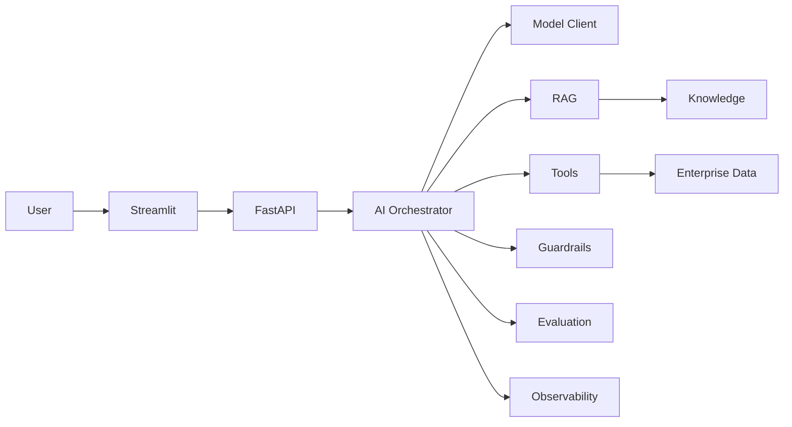

# Capstone Architecture

```mermaid
flowchart LR
    U[User] --> UI[Streamlit]
    UI --> API[FastAPI]
    API --> ORCH[AI Orchestrator]
    ORCH --> LLM[Model Client]
    ORCH --> RAG[RAG]
    ORCH --> TOOLS[Tools]
    ORCH --> SEC[Guardrails]
    RAG --> KB[Knowledge]
    TOOLS --> DATA[Enterprise Data]
    ORCH --> EVAL[Evaluation]
    ORCH --> OBS[Observability]
```

The LLM is one component of the system, not the system itself.
